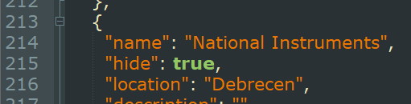
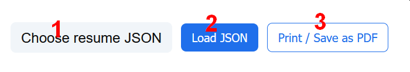
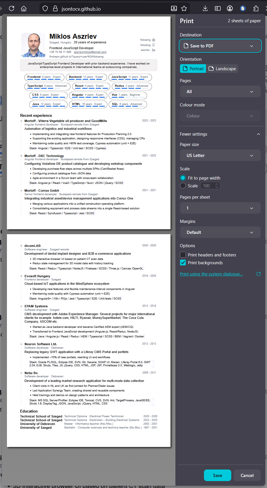

# Templating JSON resume format CV for print to PDF

You can upload your CV in JSON CV format and convert to PDF using browser print dialog.
Use print to PDF with A4 paper size, set print with backgrounds and without headers to have a PDF CV rendered preserving links too.

## How to use

Create your JSON resume using JSON resume format.

You can use a lot of editors and sites for it over the net, I recommend the 
[https://gitconnected.com/](https://gitconnected.com/) site where you can build it and share it and download the resume to JSON in API section.

The gitconnected site has recently some bugs.
For example the Skill form is not saving yearsOfExperience property etc.
so I suggest you to edit your generated JSON data and fill missing stuff.

Here is an example of my old detailed CV there:
[https://gitconnected.com/fotoamg/resume](https://gitconnected.com/fotoamg/resume)

You can download my old huge JSON from there too.
[https://gitconnected.com/api/v1/resume/fotoamg](https://gitconnected.com/api/v1/resume/fotoamg)

This template only lists some basic data, skills, work, education.
Not listing for example languages, certificates etc. as I wanted to be as short as possible to match 1-2 sides for PDF print.
If you need more details you can fork or download the html and edit and add the sections you need.

# Edit your JSON and fine tune for my custom render

I added and extra option to shrink data and skip old workplaces.
In the work items you can add a property "hide": true for each item you wish to skip from render.

In the "highlights" array the last item is highlighted more and I added the tech stack list there starting with "Stack: " line.
You can also use it for that.

# Render your CV and save as PDF

Go tho [https://jsontocv.github.io/](https://jsontocv.github.io/) to view it in the browser.

It will load my hardcoded minimalist CV json data in 200millisec to have a preview of the render.

If it looks like rendering fine you can start the short process to create your PDF by these steps:

Use the 1. button to browse for your CV json file and select it.
Use the 2. button to load and render the data to the html template.
USe the 3. button to use browser's print dialog and save to PDF.

It is important:
In the browser's save dialog you have to set the page size to A4 os similar to fit the pages and set print with backgrounds and without headers to have a PDF CV rendered preserving links too.

If it does not fit fine, edit and shrink your JSON texts and data until you reach 1 page or a 2 sided page of CV max.

Have a nice time using it or to extend!

Greetings from fotoamg[at]gmail dot com ;)

